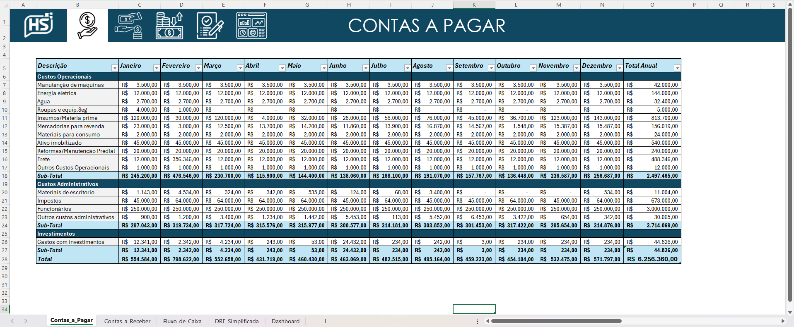
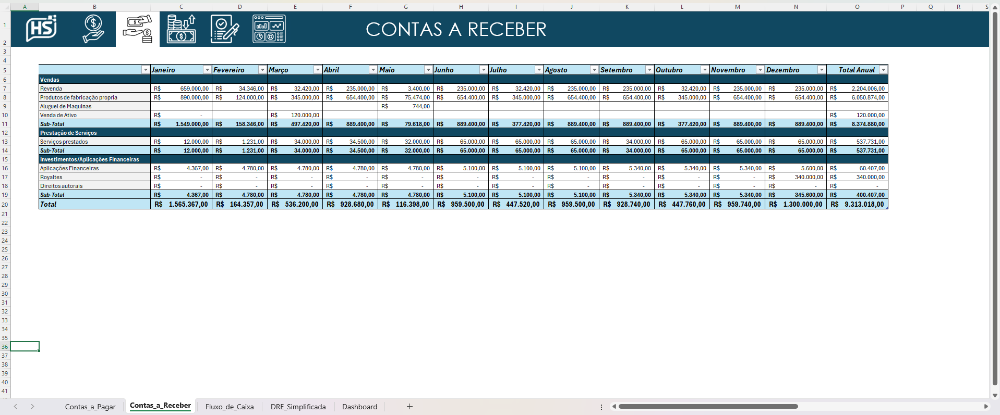
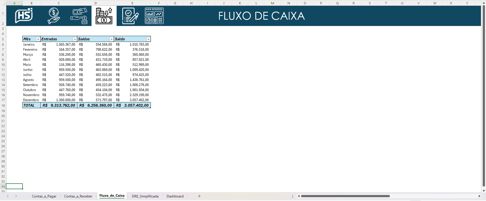
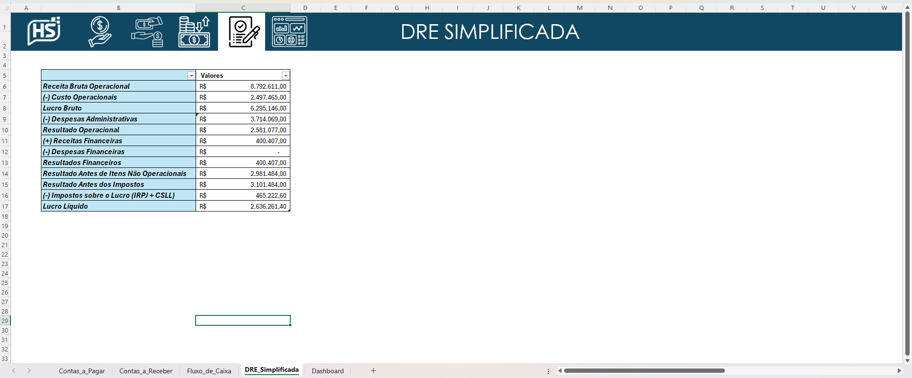

# 📊 Sistema Financeiro Empresarial em Excel

## 📌 Visão Geral

Este projeto consiste em um Sistema Financeiro Empresarial desenvolvido em Excel, focado no controle, organização e análise de dados financeiros de forma simples, visual e eficiente.

O objetivo principal é transformar o Excel em uma ferramenta de gestão financeira, permitindo acompanhar resultados, identificar gargalos e apoiar a tomada de decisão baseada em dados.

O projeto foi desenvolvido com boas práticas de organização, integração entre planilhas e uso de dashboards para facilitar a análise.

## 🎯 Objetivos do Projeto

Centralizar informações financeiras em um único sistema

Organizar contas a pagar e contas a receber

Controlar fluxo de caixa de forma clara

Gerar indicadores financeiros automáticos

Criar dashboards visuais para análise rápida

Facilitar a tomada de decisão financeira

## 💰 Fluxo de Caixa

Entradas e saídas organizadas por período

Saldo automático

Acompanhamento mensal

## 📈 DRE Simplificado

Total de receitas

Total de despesas

Resultado financeiro (lucro/prejuízo)

Comparativo entre períodos

## 📊 Dashboard Gerencial

Gráficos dinâmicos

Visualização clara dos principais indicadores

Apoio à análise rápida e estratégica

## 🧱 Estrutura do Projeto

O sistema é composto por planilhas integradas, como:

Base de Receitas

Base de Despesas

Fluxo de Caixa

Indicadores Financeiros

Dashboard

Toda a estrutura foi pensada para ser:

Escalável

Fácil de entender

Simples de manter

## 📊 Resultados Obtidos

Com a utilização deste sistema, é possível:

✅ Reduzir erros de controle financeiro

✅ Ter visão clara da saúde financeira da empresa

✅ Identificar despesas excessivas

✅ Acompanhar evolução financeira ao longo do tempo

✅ Ganhar agilidade na análise de dados

O projeto demonstra como o Excel pode ir além de planilhas básicas e se tornar uma ferramenta poderosa de gestão financeira.

## 🚀 Tecnologias Utilizadas

Microsoft Excel

Fórmulas avançadas

Tabelas estruturadas

Gráficos dinâmicos

Organização modular de dados

## 📸 Screenshots do Projeto

### 📋 Contas a Pagar

### 📋 Contas a Receber

### 💰 Fluxo de Caixa

### 📋 DRE Simplificado

### 📊 Dashboard Financeiro

## 👨‍💻 Autor

Hadilton Silva
Analista / Desenvolvedor em formação, com foco em análise de dados, automação e criação de soluções práticas para negócios.

📌 Projeto desenvolvido para fins de aprendizado, portfólio e aplicação prática em cenários reais.

📂 Como Utilizar

Baixe o arquivo do projeto

Abra no Microsoft Excel

Alimente as planilhas de receitas e despesas

Os indicadores e dashboards serão atualizados automaticamente

⭐ Considerações Finais

Este projeto reforça a importância da organização de dados financeiros e mostra como soluções simples podem gerar grande impacto na gestão de um negócio.

Sinta-se à vontade para explorar, adaptar e evoluir este sistema.

